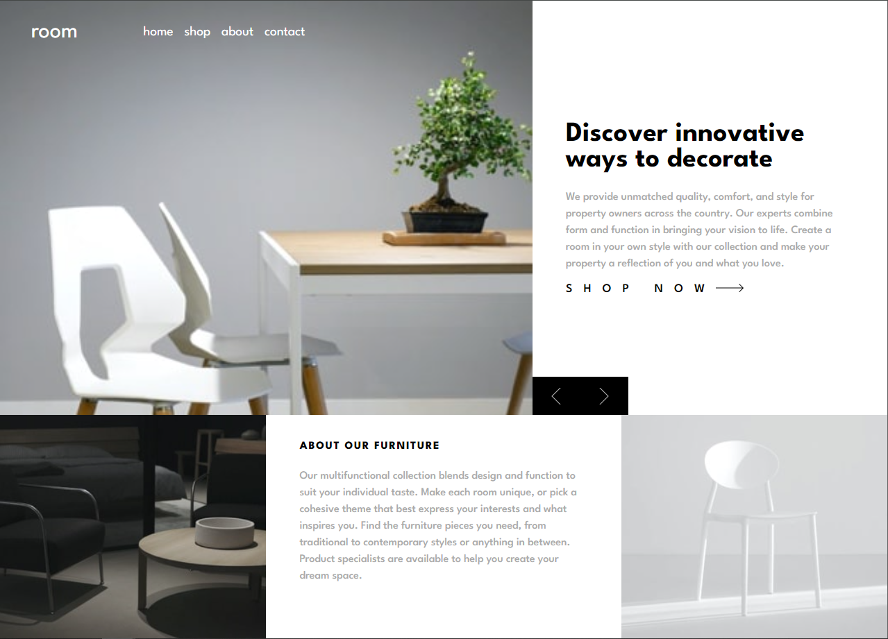
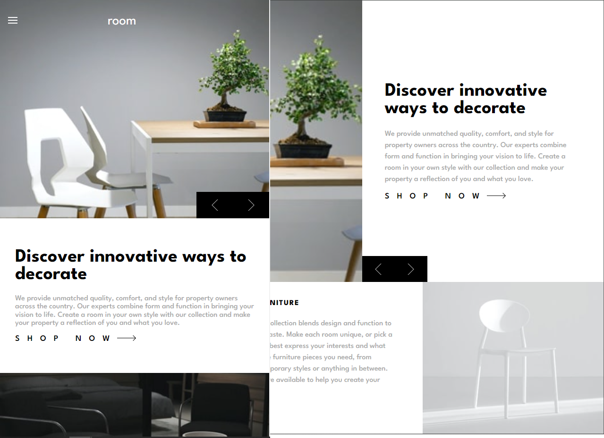

# FrontEndMentor-Furniture-mockup

Creation of a project in HTML and CSS. The mockup involves laying out a responsive website with:

- burger menu
- desktop layout design using flex-wrap

## Screenshots

## My process:

### Built with:

- HTML5
- CSS
- Flexbox
- VSC

### What I learned:

For each new project, positioning with Flexbox becomes easier. Choosing selectors was a significant challenge, always aiming to maintain clean code and simplify development.

### Continued development:

In the future, I plan to integrate JavaScript into these projects (which will be covered in upcoming training) to make them more dynamic.

### Useful resources:

- W3 Schools for media queries
- ChatGPT: not used much, but it opened me up to other possibilities in terms of development.

## Authors

- [@WebisBrian](https://github.com/WebisBrian)

- [Linkedin] (https://www.linkedin.com/in/brian-tabart)

## Training ROADMAP

From 09/17/2024 to 06/06/2025

- HTML (in progress)

- CSS (in progress)

- JavaScript (starting 10/01/2024)

- Git

- REACT (starting 11/28/2024)

- PHP (starting 11/29/2024)

- Symfony (starting 12/12/2024)

- Internship from 03/03/2025 to 05/16/2025

## Screenshots

